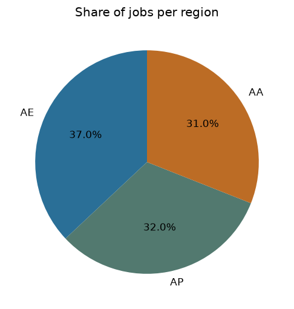
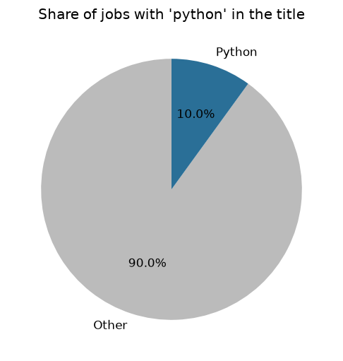
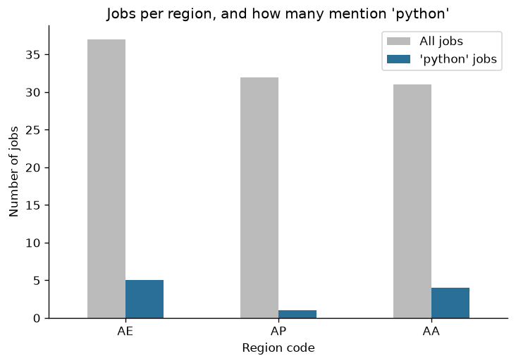
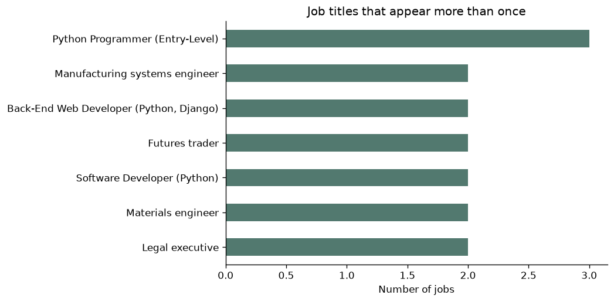

# Python Job Listings Scraper

A beginner-friendly web scraper that collects job listings from the [Fake Python Jobs](https://realpython.github.io/fake-jobs/) practice site, saves them to CSV, and uses pandas to answer questions about the data with tables and charts.

The target site is built for learning, so it is safe to scrape and has no anti-bot protection. The data is fake, so the findings below are for practice.

## Questions this project answers

1. **What does the data look like?** How many jobs, which columns, any missing values or duplicates?
2. **Which regions have the most jobs?**
3. **How many jobs mention Python in the title, and where are they?**
4. **Which job titles appear most often?**

## Results

*Based on the 100 listings on the site. Regenerate everything with `python3 generate_charts.py`.*

### 1. What does the data look like?

- **100 jobs** and **4 columns**: `title`, `company`, `location`, `url`
- Each location ends with a two-letter region code (`AA`, `AE` or `AP`), which I extracted into a `region` column
- No missing values or duplicate rows were found (check with `df.isna().sum()` and `df.duplicated().sum()`)

First rows of `jobs.csv`:

| title | company | location | url |
|---|---|---|---|
| Senior Python Developer | Payne, Roberts and Davis | Stewartbury, AA | https://realpython.github.io/fake-jobs/jobs/senior-python-developer-0.html |
| Energy engineer | Vasquez-Davidson | Christopherville, AA | https://realpython.github.io/fake-jobs/jobs/energy-engineer-1.html |
| Legal executive | Jackson, Chambers and Levy | Port Ericaburgh, AA | https://realpython.github.io/fake-jobs/jobs/legal-executive-2.html |
| Fitness centre manager | Savage-Bradley | East Seanview, AP | https://realpython.github.io/fake-jobs/jobs/fitness-centre-manager-3.html |
| Product manager | Ramirez Inc | North Jamieview, AP | https://realpython.github.io/fake-jobs/jobs/product-manager-4.html |

### 2. Which regions have the most jobs?

Jobs are spread almost evenly across the three regions. `AE` has the most (37%), but the gap to the others is small.



### 3. How many jobs mention Python, and where?

**10 of 100 jobs (10%)** have "python" in the title. Half of them (5) are in `AE`, while `AP` has only one.





| region | jobs | share_pct | python_jobs |
|---|---|---|---|
| AE | 37 | 37.0 | 5 |
| AP | 32 | 32.0 | 1 |
| AA | 31 | 31.0 | 4 |

### 4. Which job titles appear most often?

Most titles appear only once. Seven appear more than once, and **Python Programmer (Entry-Level)** is the most repeated (3 times).



| title | jobs |
|---|---|
| Python Programmer (Entry-Level) | 3 |
| Legal executive | 2 |
| Materials engineer | 2 |
| Software Developer (Python) | 2 |
| Futures trader | 2 |
| Manufacturing systems engineer | 2 |
| Back-End Web Developer (Python, Django) | 2 |

### Key findings

1. The 100 jobs are split almost evenly between regions: AE 37, AP 32, AA 31.
2. Python roles make up 10% of the listings, concentrated in AE (5) and AA (4). In AP, only 1 of 32 jobs mentions Python.
3. Job titles are very varied: only 7 titles repeat at all.

## Tools

Python | Requests | Beautiful Soup | pandas | matplotlib | Jupyter in VS Code

## Installation

```bash
git clone https://github.com/KhulisoJohn/jobs-scraper-and-analysis.git
cd <jobs-scraper-and-analysis>

python3 -m venv venv
source venv/bin/activate          # Windows: venv\Scripts\activate
pip install -r requirements.txt
```

Requires Python 3.10 or newer.

## Usage

```bash
# 1. Scrape the jobs
python3 Job_Scraper.py                              # all jobs -> jobs.csv
python3 Job_Scraper.py -k python                    # only titles containing "python"
python3 Job_Scraper.py -k engineer -o engineer_jobs.csv

# 2. Explore the data in the terminal
python3 explore_jobs.py

# 3. Get a one-sentence finding
python3 jobs_insights.py

# 4. Create the charts and tables used in this README
python3 generate_charts.py
```

For tables and charts in VS Code, open `explore_jobs.ipynb`, select the `venv` kernel, and run the cells with **Shift+Enter**.

## Project structure

```
.
├── Job_Scraper.py        # scraper: fetch, parse, filter, save to CSV
├── explore_jobs.py       # pandas exploration in the terminal
├── explore_jobs.ipynb    # notebook: tables and pie charts
├── jobs_insights.py      # question -> chart -> one-sentence finding
├── generate_charts.py    # creates images/ and results.md for this README
├── images/               # charts used in this README
├── results.md            # tables generated by generate_charts.py
├── jobs.csv              # output of the scraper
├── requirements.txt
├── README.md
└── .gitignore
```

## How the scraper works

1. `parse_args()` reads the `--keyword` and `--output` options.
2. `fetch_page()` downloads the HTML and raises an error on a bad response.
3. `parse_jobs()` finds every `div.card-content` and extracts the fields with CSS selectors.
4. `get_text()` and `get_apply_url()` return `""` when an element is missing instead of crashing.
5. `filter_jobs()` keeps only titles containing the keyword, if one was given.
6. `save_to_csv()` writes the results to a CSV file.

## Limitations

- The data is fake and has only three region codes, so the findings show how to analyse data, not real job market facts.
- "Python jobs" are counted by keyword in the title, so a job that uses Python but doesn't say so is missed.
- The scraper depends on the page's HTML structure and breaks if the site changes.

## What I learned

- Inspect the page's HTML first: a single misspelled class name (`card-contant`) returned zero results.
- Every analysis follows the same loop: ask a question, query the data, chart it, explain it in plain English.
- Percentages next to counts give a fairer picture than counts alone.
- Pie charts suit 2 to 3 categories; bar charts suit more.

## Ideas for improvement

- Scrape each job's detail page for the full description
- Add unit tests for `parse_jobs()` using a saved HTML sample
- Filter by location or company as well as title
- Export to JSON or SQLite

## Disclaimer

For educational purposes only. Always check a website's terms of service and `robots.txt` before scraping a real site.

## License

MIT
